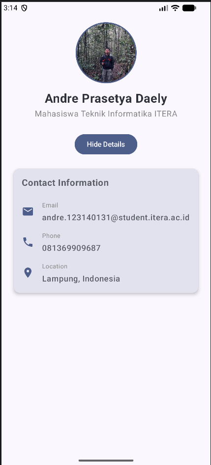

#  Tugas Praktikum PAM Week 3

Aplikasi profil diri sederhana yang dibangun menggunakan **Jetpack Compose** sebagai bagian dari tugas praktikum Pengembangan Aplikasi Mobile.

## 📝 Deskripsi Tugas
Membangun aplikasi Android dengan fitur:
1. **Halaman Profil**:
   - Header dengan foto profil (Circular) dan Nama.
   - Bio/Deskripsi singkat.
   - Informasi kontak: Email, Phone, dan Location.
2. **Minimal 3 Reusable Composable Functions**:
   - `ProfileHeader`
   - `ProfileCard`
   - `InfoItem`
3. **Penggunaan Komponen Dasar**: Column, Row, Box, Card, Text, Button, Image, dan Icon.
4. **Bonus**: Implementasi animasi menggunakan `AnimatedVisibility`.

## 🚀 Fitur & Implementasi
- **ProfileHeader**: Menampilkan foto profil melingkar menggunakan `clip(CircleShape)` dan `border`.
- **ProfileCard**: Kartu informasi yang muncul/hilang dengan animasi fade.
- **InfoItem**: Komponen baris yang dapat digunakan kembali untuk setiap entri data kontak.
- **Interaktivitas**: Tombol "Show Details" untuk memicu animasi transisi.

## 🛠️ Tech Stack & Komponen
- **Jetpack Compose**
- **Material Design 3**
- **Layouts**: `Column`, `Row`, `Box`
- **UI Elements**: `Text`, `Button`, `Image`, `Icon`, `Card`
- **Animation**: `AnimatedVisibility` (Fade In/Out)

## 📸 Screenshot

## 👤 Identitas
- **Nama**: Andre Prasetya Daely
- **NIM**: 123140131
- **Prodi**: Teknik Informatika ITERA
- **Branch**: `week-3`
