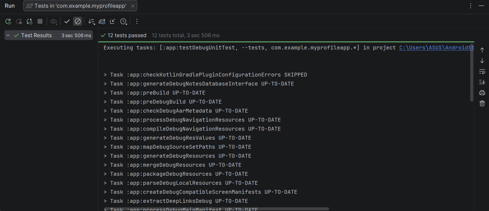
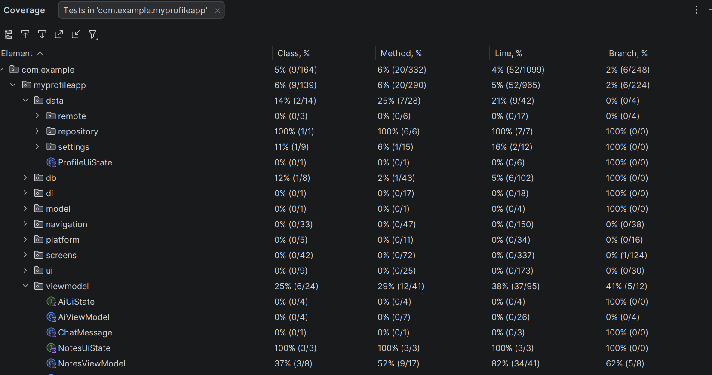

# My Notes App - Tugas Praktikum PAM Week 10

Aplikasi manajemen catatan yang telah ditingkatkan dengan Dependency Injection (Koin) yang lebih modular dan implementasi Testing yang komprehensif.

## 📝 Deskripsi Tugas (Minggu 10)
Implementasi DI dan Testing untuk Notes App:
1. **Setup Koin DI**: Pemisahan modul DI menjadi minimal 2 modul (`dataModule` & `viewModelModule`).
2. **Unit Test NoteRepository**: Implementasi minimal 5 test cases untuk logika repository.
3. **Unit Test NotesViewModel**: Menggunakan **MockK** untuk mocking dependensi dan minimal 4 test cases.
4. **Flow Test**: Menggunakan **Turbine** untuk menguji stream data (Flow) minimal 2 test cases.
5. **UI Test NotesScreen**: Menggunakan **Compose Test Rule** untuk menguji antarmuka minimal 3 test cases.
6. **Code Coverage**: Memastikan cakupan testing minimal 60% untuk business logic.

## 🧪 Test Cases
### 1. NoteRepositoryTest
- `insertNote calls queries insertNote`: Memastikan fungsi insert memanggil query database yang benar.
- `updateNote calls queries updateNote`: Memastikan fungsi update memanggil query database yang benar.
- `deleteNote calls queries deleteNote`: Memastikan fungsi delete memanggil query database yang benar.
- `getAllNotes calls queries getAllNotes`: Memastikan pengambilan semua data memanggil query yang benar.
- `searchNotes calls queries searchNotes`: Memastikan fitur pencarian memanggil query dengan parameter yang benar.

### 2. NotesViewModelTest
- `initial state is Loading`: Memastikan UI state awal adalah Loading.
- `uiState updates to Success when notes are loaded`: Memastikan state berubah ke Success saat data tersedia.
- `uiState updates to Empty when no notes found`: Memastikan state berubah ke Empty saat data kosong.
- `onSearchQueryChange updates searchQuery flow`: Memastikan perubahan kata kunci pencarian terupdate di flow.
- `toggleFavorite calls repository updateNote`: Memastikan aksi favorit memicu update di repository.
- `isOnline flow works with Turbine`: Menguji stream status jaringan menggunakan Turbine.

### 3. NotesScreenTest (UI Test)
- `loadingIndicator_isDisplayed_whenStateIsLoading`: Memastikan indikator loading muncul saat state loading.
- `emptyMessage_isDisplayed_whenStateIsEmpty`: Memastikan pesan kosong muncul saat tidak ada catatan.
- `noteList_isDisplayed_whenStateIsSuccess`: Memastikan daftar catatan muncul saat data tersedia.
- `offlineIndicator_isDisplayed_whenIsOnlineIsFalse`: Memastikan indikator offline muncul saat tidak ada koneksi.

## 📊 Code Coverage
Cakupan testing difokuskan pada `NoteRepository` dan `NotesViewModel` yang merupakan inti dari business logic aplikasi.
(Screenshot coverage report dapat dilihat di folder Bukti)

## 🛠️ Tech Stack & Testing Tools
- **MockK**: Library mocking untuk Kotlin.
- **Turbine**: Library untuk pengujian Kotlin Flows.
- **Koin Test**: Integrasi testing untuk Koin DI.
- **Compose UI Test**: Pengujian UI untuk Jetpack Compose.

## 📸 Screenshots
*(Letakkan screenshot Anda di sini sesuai kategori)*

| Unit Test Results | UI Test Results | Code Coverage Report |
|:-----------------:|:---------------:|:--------------------:|
|  |  |  |

## 👤 Identitas
- **Nama**: Andre Prasetya Daely
- **NIM**: 123140131
- **Prodi**: Teknik Informatika ITERA
- **Branch**: `week-10`
