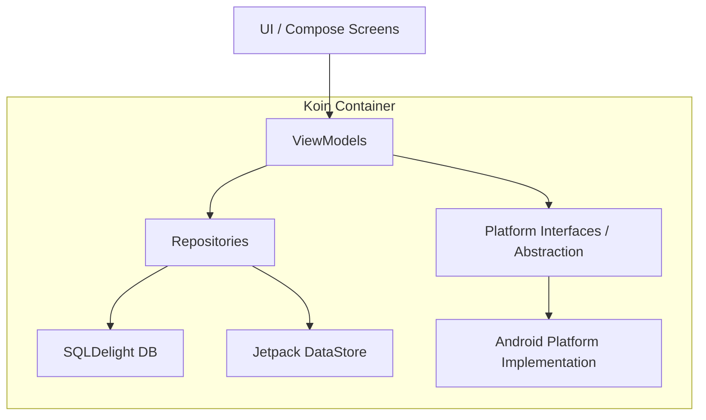

# My Notes App - Tugas Praktikum PAM Week 8

Aplikasi manajemen catatan yang telah ditingkatkan dengan Dependency Injection (Koin), Platform Features (DeviceInfo, NetworkMonitor), dan arsitektur yang lebih modular.

## 📝 Deskripsi Tugas (Minggu 8)
Upgrade aplikasi Notes dengan fitur-fitur berikut:
1. **Koin Dependency Injection**: Implementasi DI untuk seluruh komponen aplikasi (ViewModel, Repository, Database, Platform).
2. **Platform Features (Expect/Actual Pattern)**: 
    - **DeviceInfo**: Menampilkan informasi hardware perangkat.
    - **NetworkMonitor**: Memantau status koneksi internet secara real-time.
    - **BatteryInfo (Bonus)**: Menampilkan level baterai dan status pengisian daya.
3. **UI Integration**:
    - Indikator status jaringan di layar utama.
    - Informasi perangkat di layar pengaturan.
4. **Architecture Refactoring**: Pemisahan logika platform dan aplikasi menggunakan abstraksi.

## 🏗️ Architecture Diagram
Aplikasi menggunakan **MVVM Architecture** dengan **Dependency Injection** menggunakan Koin:

## 🚀 Fitur & Implementasi
- **Dependency Injection**: Menggunakan Koin untuk mempermudah pengelolaan dependensi dan pengujian.
- **Real-time Network Monitoring**: Memberikan feedback instan kepada pengguna saat offline.
- **Hardware Abstraction**: Menggunakan pattern abstraksi (expect/actual) untuk mengakses fitur spesifik platform (Android).

## 🛠️ Tech Stack
- **Jetpack Compose** (UI)
- **Koin** (Dependency Injection)
- **SQLDelight** (Local Database)
- **Jetpack DataStore** (Preferences)
- **Kotlin Flow** (Reactive Data Stream)
- **MVVM Architecture**

## 📸 Screenshots
*(Letakkan screenshot Anda di sini sesuai kategori)*
| Daftar Catatan & Network Status | Info Perangkat & Baterai | Pengaturan Urutan |
|:---:|:---:|:---:|
|  |  |  |

| Tambah/Edit Catatan | Kondisi Kosong |
|:---:|:---:|
|  |  |

## 👤 Identitas
- **Nama**: Andre Prasetya Daely
- **NIM**: 123140131
- **Prodi**: Teknik Informatika ITERA
- **Branch**: `week-8`
