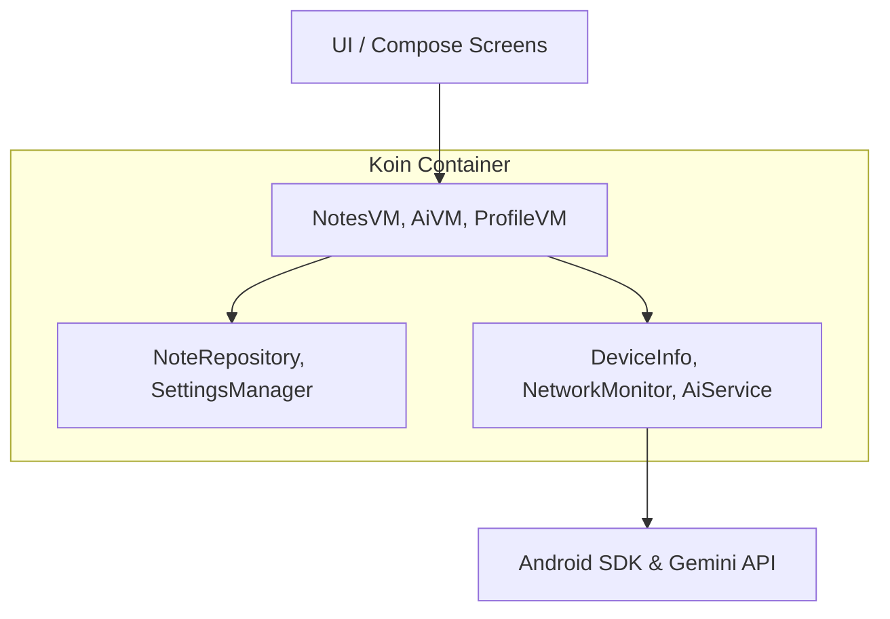
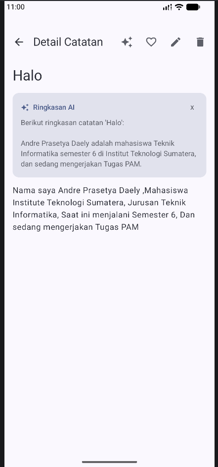
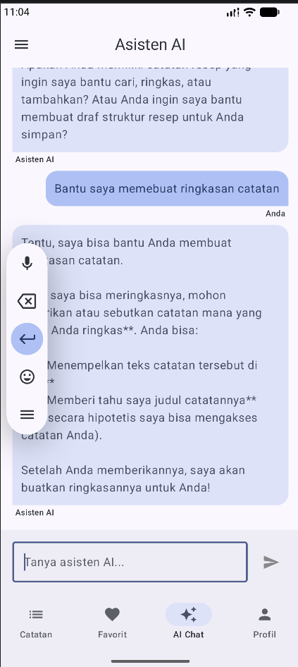
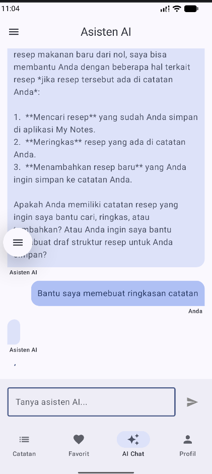

# My Notes App - Tugas Praktikum PAM Week 9

Aplikasi manajemen catatan yang kini terintegrasi dengan kecerdasan buatan (AI) menggunakan **Gemini API**.

## 📝 Deskripsi Tugas (Minggu 9)
Integrasi fitur AI ke dalam aplikasi:
1. **Gemini AI Integration**: Menggunakan Google AI SDK untuk menghadirkan fitur pintar.
2. **Smart Note Summary**: AI dapat membuat ringkasan singkat dari isi catatan pengguna.
3. **AI Assistant Chat**: Fitur chat interaktif (Multi-turn conversation) untuk bertanya seputar catatan atau hal umum lainnya.
4. **Error Handling & Loading States**: Penanganan error API secara anggun dan tampilan loading yang responsif.
5. **System Prompt Engineering**: Instruksi sistem yang dirancang agar AI bertindak sebagai asisten catatan yang profesional.

## 🚀 Fitur AI Terbaru
- **Ringkasan Catatan**: Klik ikon AI di detail catatan untuk mendapatkan poin-poin penting secara otomatis.
- **Asisten AI (Chatbot)**:
    - Mendukung percakapan berkelanjutan (Multi-turn).
    - **Streaming Response**: Jawaban AI muncul secara real-time saat teks dihasilkan.
- **Bahasa Indonesia**: AI dikonfigurasi khusus untuk merespon dalam Bahasa Indonesia yang baik.

## 🏗️ Architecture Diagram (Updated)
Aplikasi menggunakan **MVVM Architecture** dengan **Dependency Injection (Koin)**:

## 🛠️ Tech Stack & Dependencies
- **Google AI SDK** (`com.google.ai.client.generativeai`)
- **Koin** (Dependency Injection)
- **Jetpack Compose** (UI)
- **SQLDelight** (Database)

## 📸 Screenshots
*(Letakkan screenshot Anda di sini sesuai kategori)*

| Ringkasan Catatan (AI Summary) | Asisten AI (Chat) | Loading State |
|:---:|:---:|:---:|
|  |  |  |

## 👤 Identitas
- **Nama**: Andre Prasetya Daely
- **NIM**: 123140131
- **Prodi**: Teknik Informatika ITERA
- **Branch**: `week-9`

