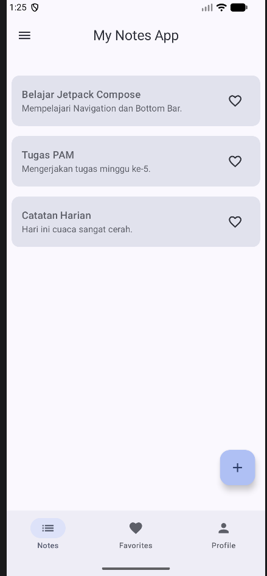
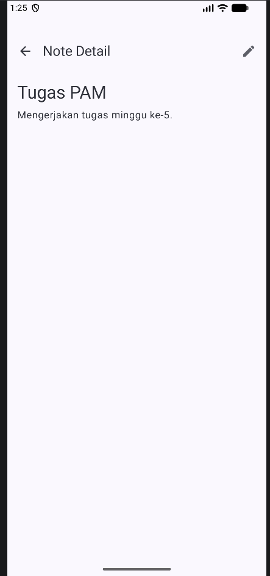
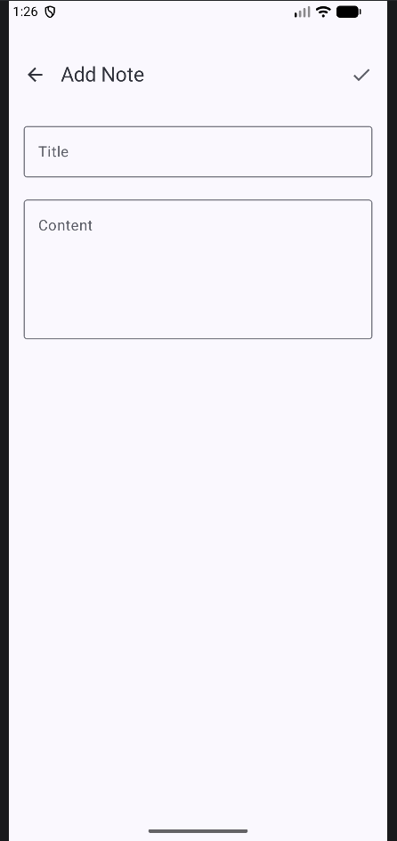
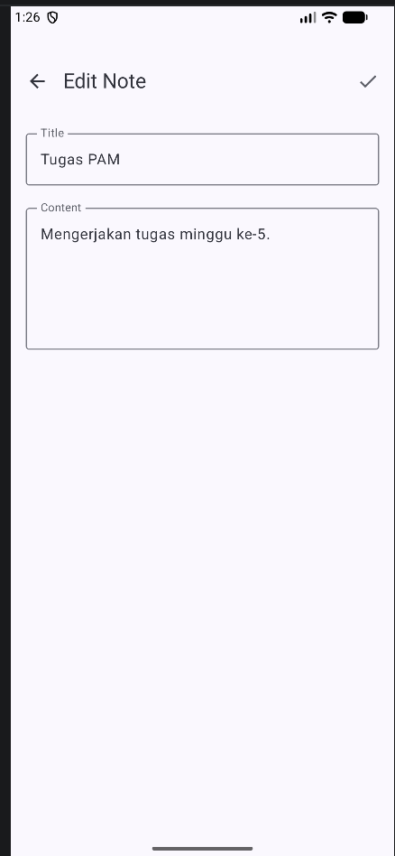
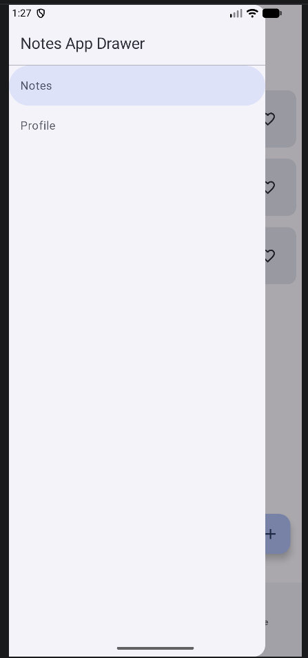

# My Notes App - Tugas Praktikum PAM Week 5

Aplikasi manajemen catatan sederhana yang dikembangkan dengan **Jetpack Compose Navigation** dan arsitektur **MVVM**.

## 📝 Deskripsi Tugas (Minggu 5)
Mengembangkan fitur navigasi pada aplikasi:
1. **Bottom Navigation**: 3 tab utama (Notes, Favorites, Profile).
2. **Note List to Detail**: Navigasi dari daftar catatan ke detail catatan dengan mengirimkan `noteId`.
3. **Floating Action Button**: Menambahkan catatan baru melalui navigasi ke `AddNoteScreen`.
4. **Edit Note**: Fitur mengedit catatan dengan argumen `noteId`.
5. **Back Navigation**: Implementasi tombol kembali yang proper di semua layar.
6. **Bonus**: Implementasi **Navigation Drawer** untuk akses cepat ke menu utama.

## 🚀 Fitur & Implementasi
- **Navigation Graph**: Menggunakan `NavHost` untuk mengelola rute antar layar.
- **Passing Arguments**: Mengirimkan data antar layar secara aman menggunakan argumen rute.
- **Scaffold Integration**: Integrasi Top Bar, Bottom Bar, dan FAB dalam satu struktur halaman.
- **State Management**: Data tetap sinkron antara list, detail, dan edit menggunakan ViewModel bersama.

## 🛠️ Struktur Folder
- `navigation/`: Berisi `Screen.kt` (rute) dan `MainNavigation.kt` (graf navigasi).
- `screens/`: Berisi layar fungsional (`NotesScreen`, `NoteDetailScreen`, dll).
- `viewmodel/`: Berisi `NotesViewModel` dan `ProfileViewModel`.
- `model/`: Berisi data model `Note.kt`.

## 📸 Screenshots
1. **Notes List**

2. **Favorites List**

3. **Note Detail**

4. **Add Note Form**

5. **Edit Note Form**

6. **Navigation Drawer**

## 👤 Identitas
- **Nama**: Andre Prasetya Daely
- **NIM**: 123140131
- **Prodi**: Teknik Informatika ITERA
- **Branch**: `week-5`
