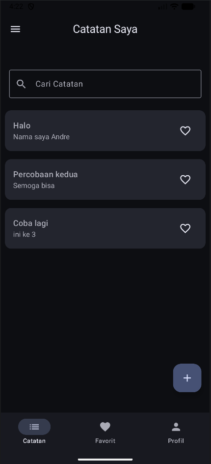
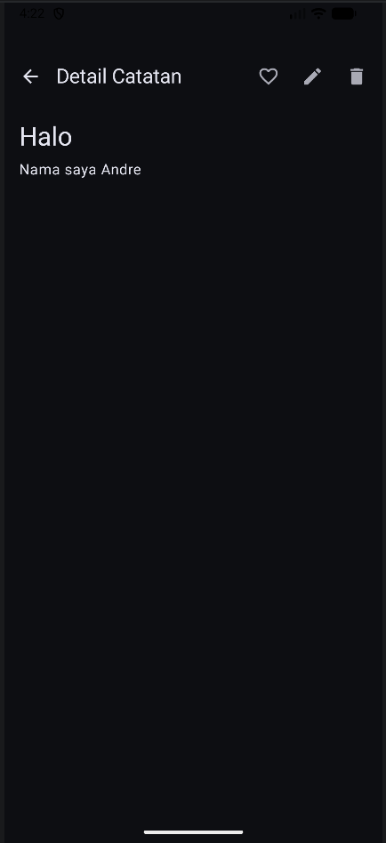
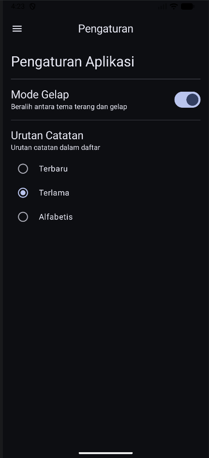
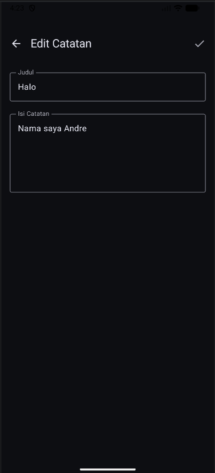
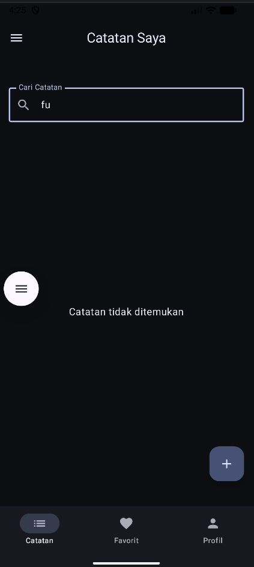

# My Notes App - Tugas Praktikum PAM Week 7 

Aplikasi manajemen catatan yang telah ditingkatkan dengan fitur database lokal, manajemen preferensi, dan arsitektur yang lebih solid.

## 📝 Deskripsi Tugas (Minggu 7)
Upgrade aplikasi Notes dengan fitur-fitur berikut:
1. **SQLDelight Database**: Implementasi database lokal untuk penyimpanan data yang persisten.
2. **CRUD Operations**: Mendukung fungsionalitas Create, Read, Update, dan Delete catatan.
3. **Search Functionality**: Fitur pencarian catatan secara real-time.
4. **Settings Screen**: Pengaturan aplikasi menggunakan **DataStore** (Theme & Sort Order).
5. **Offline-first**: Data tersimpan sepenuhnya di perangkat lokal.
6. **UI States**: Implementasi state yang jelas (Loading, Empty, Content).

## 🚀 Fitur & Implementasi
- **Database Lokal**: Menggunakan SQLDelight untuk performa tinggi dan type-safety.
- **Data Persistence**: Menggunakan Jetpack DataStore untuk menyimpan preferensi user seperti Dark Mode.
- **Search & Filter**: Pencarian catatan berdasarkan judul atau isi konten.
- **Custom Sorting**: Pengurutan catatan berdasarkan Terbaru, Terlama, atau Alfabetis.

## 🛠️ Tech Stack
- **Jetpack Compose** (UI)
- **SQLDelight** (Local Database)
- **Jetpack DataStore** (Preferences)
- **Kotlin Flow** (Reactive Data Stream)
- **MVVM Architecture**

## 📸 Screenshots
| Daftar Catatan & Pencarian | Detail Catatan | Pengaturan & Urutan |
|:---:|:---:|:---:|
|  |  |  |

| Tambah/Edit Catatan | Kondisi Kosong |
|:---:|:---:|
|  |  |

## 👤 Identitas
- **Nama**: Andre Prasetya Daely
- **NIM**: 123140131
- **Prodi**: Teknik Informatika ITERA
- **Branch**: `week-7`
